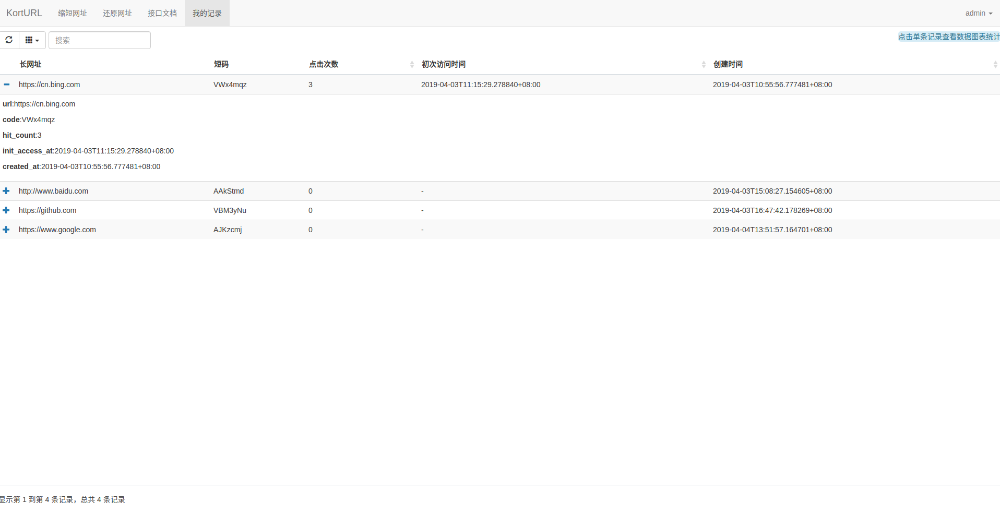
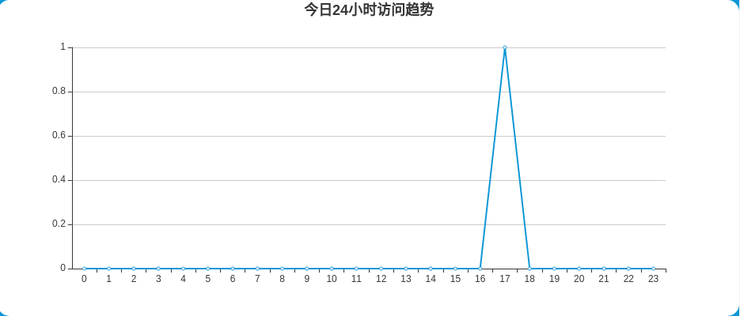
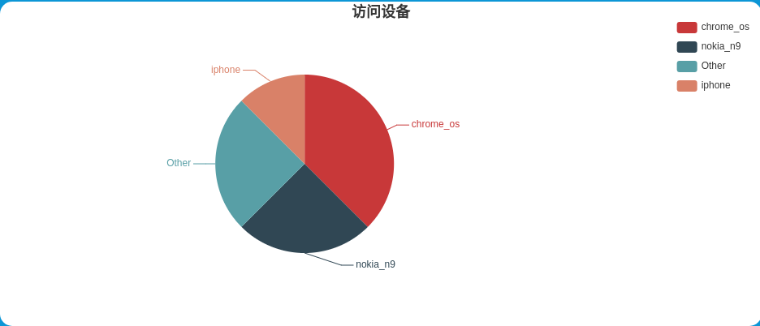
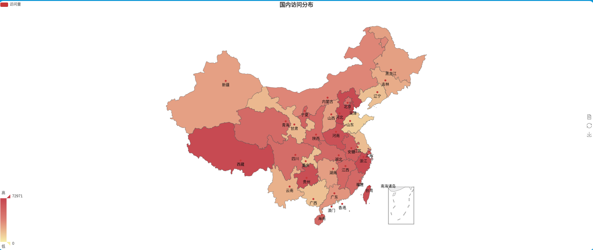

KortURL
=======
[](https://www.python.org/)


One-stop short URL service based on django.基于django的一站式的短网址服务,提供浏览器端及API两种方式缩短网址,以及可视化的,实时的,细粒度的流量追踪。


## 项目介绍
One-stop short URL service based on django.基于django的一站式的短网址服务,提供浏览器端及API两种方式缩短网址,以及可视化的,实时的,细粒度的流量追踪。欢迎Issue & PR!

* 浏览器端长网址的缩短，还原。
* 缩短网址API。
* 简单而有效的双端认证系统,规避恶意攻击,并极其方便开设账号。
* 每日访问量的统计与图表展示。
* 24小时访问趋势的统计与图表展示。
* 访问设备的统计与图表展示。
* 访客操作系统的统计与图表展示。
* 浏览器的统计与图表展示。
* 运营商的统计与图表展示。
* 国内访问分布的统计与图表展示。

### 缩短网址页

### 历史记录页

### 访问量

### 24小时访问趋势

### 访问设备

### 操作系统

### 浏览器

### 运营商

### 国内访问分布


## 部署(以Ubuntu16.04为例)
### 1.环境与依赖
#### 依赖安装:
```text
pip3 install pipenv
```
在项目根目录下:
```text
pipenv update
```
#### redis安装
```text
sudo apt-get update
sudo apt-get install redis-server
```
> 安装后配置文件在`/etc/redis/redis.conf`。

#### 数据库选择
Django ORM支持的数据库，任意一种都可以。但为了节约时间，建议你使用mysql作为持久化数据库。

以mysql为例:

安装mysql:
```text
sudo apt-get install mysql-server
```

安装成功后:

```text
pipenv install pymysql
```
安装成功后，在KortURL/\_\_init__.py文件中增加:
```python
import pymysql

pymysql.install_as_MySQLdb()
```


### 2.参数设置
配置文件位于KortURL/settings.py

API身份验证模块:
* SIMPLE_JWT.ACCESS_TOKEN_LIFETIME: 令牌过期时间。默认5分钟。
* SIMPLE_JWT.REFRESH_TOKEN_LIFETIME: 刷新令牌过期时间。默认24小时。
* SIMPLE_JWT.AUTH_HEADER_TYPES: API身份验证时请求头的认证类型。默认`KortURL`。

Redis相关设置:
* REDIS_HOST: Redis的ip地址。
* REDIS_PORT: Redis的端口。
* REDIS_PASSWORD: Redis的密码。如果没有设置密码，则赋值`None`。
* MAP_CACHE_DB: 缓存长短网址键值对的Redis数据库(如果没有修改过redis配置，可选值有0-15)。
* BROKER_DB: Celery broker 使用的Redis数据库。
* RESULT_DB: Celery 任务执行结果存储Redis数据库。
> `MAP_CACHE_DB`, `BROKER_DB`, `RESULT_DB`不要设置为相同的数据库。

Celery相关设置:

这里如果你的服务器的Redis是有密码的。则注释掉无密码的两行，使用下面的两行。

KortURL 设置:
* KORT_URL.PROTOCOL: 你的服务协议。有`HTTP`和`HTTPS`两种选择，默认`HTTPS`。
* KORT_URL.SERVER_NAME: 域名。即nginx配置里的`server_name`。必须正确填写，默认是`localhost:8000`，会导致短网址无法正确跳转。
* KORT_URL.SITE_NAME: 站名。默认`KortURL`。将会显示在页面上的导航栏。
* KORT_URL.COMPANY_NAME: 企业名称。默认`KortURL`。将会显示在页面的footer。
* KORT_URL.BACKGROUND_COLOR: 页面背景色。如果你不喜欢默认的背景色。那尽管修改它!

> 如果有需要，可将static/imgs中的`favicon.ico`和`logo.png`替换为自己想要的。文件名保持一致即可。

**自定义短码**:
* KORT_URL.CODE_MAX_LENGTH: 短码的长度。默认7。
* KORT_URL.CODE_ALLOWED_CHARS: 指定构成短码的字符。默认由大小写英文字母和数字组成。

以上参数设置完毕后:
```text
pipenv run python manage.py makemigrations

pipenv run python manage.py migrate

```


### 3.uwsgi参数
* chdir: 项目在服务器中的目录(绝对路径)。
* master: 主进程模式。
* home: 虚拟环境目录(绝对路径)。
* pidfile = 指定pid文件路径。例如`你的项目路径/uwsgi.pid`。
* wsgi-file:  Django's wsgi 文件目录(通过django-admin 命令生成的项目目录都会有一个和项目容器名相同的目录,在这个目录下有wsgi.py)。
* listen: 排队请求数。可以理解为最高并发量,范围是0 - 65000。
* processes: 最大进程数(建议与cpu数量保持一致)。
* socket: 与外界连接的端口号, Nginx通过这个端口转发给uWSGI。格式:`:端口号`。
* touch-reload: 指定一个目录。该目录下文件改动时自动重启。
* py-auto-reload: Python文件改动时自动重启。不建议开启。
* vacuum: 当服务器退出的时候自动清理环境。 `true`| `false`
* daemonize: 后台运行并把日志存到指定位置。例如：`你的日志目录/uwsgi.log`。
* log-maxsize: 日志大小，单位是字节(Byte)。当大于这个大小会进行切分(按需设置)。

### 4.nginx + uwsgi配置
请看我的博客[nginx+uwsgi+django+celery部署日志][1], [nginx完整示例配置详解][2]。

### 5.celery启动
```text
pipenv run nohup celery -A KortURL worker -l info --logfile logs/celery.log &
```

### 6.uwsgi启动
```text
pipenv run uwsgi --ini 你的uwsgi配置文件名(.ini格式)
```

[1]: https://yandenghong.github.io/2018/09/14/django_project_deploy/
[2]: https://yandenghong.github.io/2019/03/21/nginx_conf/